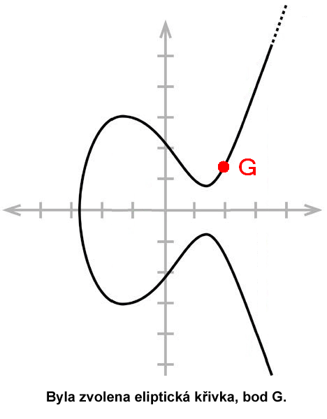

# elliptic-curve

a rust cryptographic library implementing ECDSA from scratch



## what it does

- elliptic curve point arithmetic (addition, doubling, scalar multiplication)
- ECDSA key generation, signing & verification
- finite field operations with modular arithmetic
- sha-256 message hashing

## core algorithms

- double-and-add scalar multiplication
- fermat's little theorem for modular inverse
- secp256k1-like curve parameters

## what you'll learn

- how ECDSA actually works mathematically
- elliptic curve group properties & cryptographic security
- the discrete logarithm problem
- finite field arithmetic & modular operations
- why reusing random k breaks everything (PlayStation 3 hack)
- point addition formulas & edge cases
- how bitcoin & ethereum use these primitives

## usage

```rust
use elliptic_curve::{EllipticCurve, Point, ECDSA};
use num_bigint::BigUint;

let curve = EllipticCurve {
    a: BigUint::from(2u32),
    b: BigUint::from(2u32),
    p: BigUint::from(17u32),
};

let generator = Point::Coordinate(
    BigUint::from(5u32),
    BigUint::from(1u32)
);

let ecdsa = ECDSA::new(curve, generator, BigUint::from(19u32));

// Generate keypair
let keypair = ecdsa.generate_keypair();

// Sign message
let message = b"hello world";
let signature = ecdsa.sign(message, &keypair.private_key).unwrap();

// Verify signature
assert!(ecdsa.verify(message, &signature, &keypair.public_key));
```

## run tests

```bash
cargo test
```

## certificate

[Udemy - Elliptic Curve Cryptography](https://www.udemy.com/certificate/UC-98e17775-f1f7-4d27-a2fb-fd39a70c8026/)
